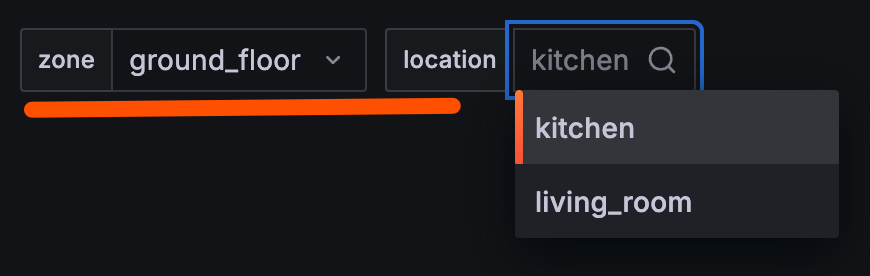
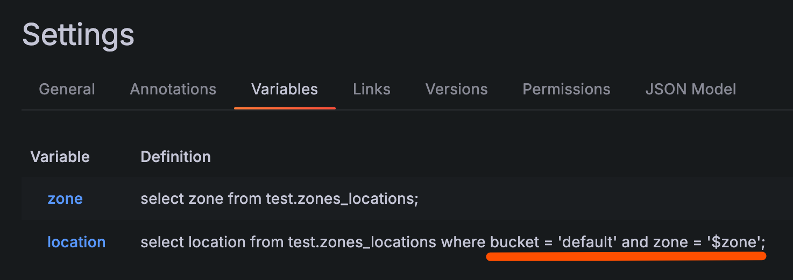

# Variables

Variables allow you to create dynamic filters for your dashboards. They can be used to query values from your Cassandra database and reference them in your queries.

## Basic Variables

Define variables in dashboard Settings > Variables. Each variable executes a CQL query to fetch available values:



Use variables in your queries by referencing them with `$variable_name` syntax.

## Chained Variables

Variables can reference other variables in their queries, creating a chain of dependent values:



In this example, the `location` variable depends on the `zone` variable using `$zone` in its query.

**Important:** Variable order matters. Variables can only reference variables defined **above** them in the list. Lower variables can depend on higher variables, but not vice versa.

## Multi-Value Variables

When a variable is configured to allow **multiple values** or the **"All"** option, you must use the `:singlequote` formatter so Grafana wraps each selected value in single quotes — as required by CQL's `IN` clause.

```sql
SELECT sensor_id, temperature, registered_at, location
FROM test.test
WHERE location IN (${location:singlequote})
  AND registered_at > $__timeFrom
  AND registered_at < $__timeTo
ALLOW FILTERING
```

> **Note:** Use `${variable:singlequote}` (curly-brace syntax with the `:singlequote` modifier) instead of the plain `$variable` shorthand. Without this formatter, multi-value selections will not produce valid CQL and the query will fail.

## Demo Data

The [`demo/sample_data.sh`](../demo/sample_data.sh) script creates example tables including `test.zones_locations` which demonstrates the chained variables feature with zone and location hierarchies.
